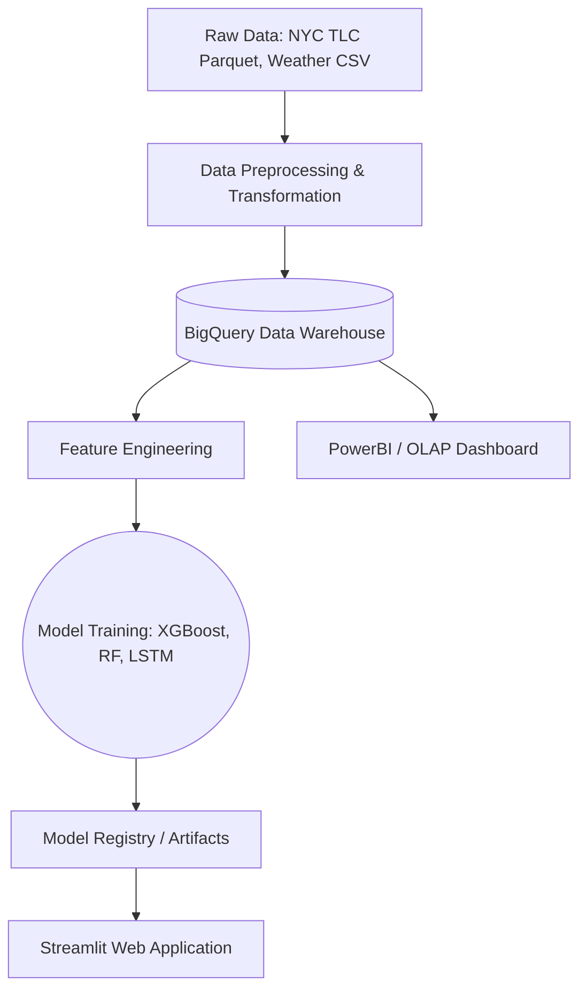

# DW-and-DSS-for-Travel-Demand-Prediction

## 1. Project Overview
This project aims to design and implement an end-to-end Data Warehouse and a Decision Support System (DSS) tailored for analyzing and predicting travel demand in complex urban environments (using NYC TLC data). By engineering a robust data pipeline, raw trip records are transformed into a structured analytical environment. This Data Warehouse serves as the foundation for training Machine Learning models to forecast future taxi demand, providing actionable insights through interactive dashboards.

## 2. System Architecture
The system consists of Data Ingestion, Data Warehousing, an MLOps Training Pipeline, and an Interactive UI.



## 3. Environment Setup
To set up the project locally:

1. **Clone the repository:**
   ```bash
   git clone <repository_url>
   cd DW-and-DSS-for-Travel-Demand-Predicttion
   ```

2. **Create and activate a virtual environment:**
   ```bash
   python -m venv .venv
   # Windows
   .venv\Scripts\activate
   # macOS/Linux
   source .venv/bin/activate
   ```

3. **Install dependencies:**
   ```bash
   pip install -r requirements.txt
   ```

4. **Environment Variables:**
   Copy the example environment file and fill in your credentials (e.g., BigQuery keys).
   ```bash
   cp .env.example .env
   ```

## 4. How to Run the Project

- **Run the ML Training Pipeline:**
  Execute the following command to ingest data, engineer features, and train all models (RF, XGBoost, LSTM).
  ```bash
  python main_ml.py
  ```

- **Run the Streamlit Dashboard:**
  Launch the interactive frontend to explore analytics and make predictions.
  ```bash
  streamlit run app/main.py
  ```
