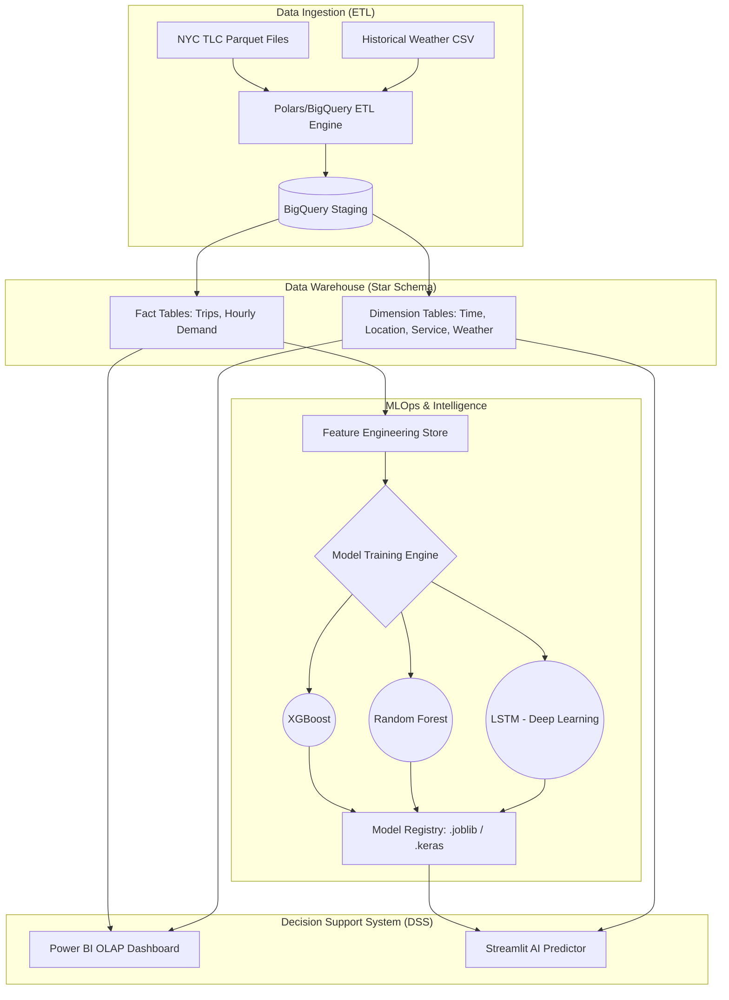

# DW and DSS for Travel Demand Prediction (NYC Taxi & For-Hire Vehicles)

## 1. Project Overview
This project delivers an end-to-end **Data Warehouse (DW)** and a **Decision Support System (DSS)** designed to analyze and predict travel demand in New York City. By processing millions of records from the NYC Taxi & Limousine Commission (TLC), we've built a scalable architecture that bridges the gap between raw Big Data and actionable business intelligence.

The system empowers urban planners and fleet operators to:
*   **Analyze** historical demand patterns via interactive OLAP dashboards.
*   **Predict** future demand using high-performance Machine Learning models (XGBoost, Random Forest, LSTM).
*   **Monitor** data health and model performance through a unified web interface.

## 2. Integrated System Architecture



## 3. Data Warehouse Design (Star Schema)
The core of the project is a **Star Schema** optimized for high-speed analytical queries:
*   **Fact_Trips**: Transactional grain (~50 columns) preserving 100% of raw attributes for auditing.
*   **Fact_Demand_Hourly**: Aggregated grain serving as the primary **Feature Store** for ML models.
*   **Conformed Dimensions**: `Dim_Time` (Hourly sequence), `Dim_Location` (265 NYC Zones), `Dim_Service_Type`, and `Dim_Weather`.

## 4. Setup & Installation

1.  **Clone the Repository:**
    ```bash
    git clone https://github.com/thanhtan2210/DW-and-DSS-for-Travel-Demand-Predicttion.git
    cd DW-and-DSS-for-Travel-Demand-Predicttion
    ```

2.  **Environment Configuration:**
    *   Create a virtual environment: `python -m venv .venv`
    *   Activate it: `.venv\Scripts\activate` (Windows) or `source .venv/bin/activate` (Mac/Linux)
    *   Install dependencies: `pip install -r requirements.txt`
    *   Setup `.env`: Copy `.env.example` to `.env` and provide your Google BigQuery credentials.

## 5. Execution Guide

### Phase 1: Data Pipeline (ETL/ELT)
Ingest raw data and build the Star Schema on BigQuery.
```bash
# Run full pipeline (Dimensions + Raw + Clean)
python main.py --all

# Run specific engine (e.g., BigQuery Cloud Engine for FHVHV)
python main.py --engine bigquery --cat fhvhv --all
```

### Phase 2: Machine Learning (MLOps)
Extract features and train forecasting models.
```bash
python main_ml.py
```

### Phase 3: Decision Support System (DSS)
Launch the interactive dashboard to visualize insights and predictions.
```bash
streamlit run app/main.py
```

## 6. Project Deliverables
*   **Interactive Web App**: Built with Streamlit, featuring real-time demand prediction.
*   **OLAP Dashboard**: Comprehensive Power BI report (`visual/nyc-dss.pbix`).
*   **Technical Documentation**: Detailed specifications in the `docs/` folder covering ETL design, DW modeling, and ML implementation.

---
**Author:** thanhtan2210  
**Project Status:** Completed (May 2026)
